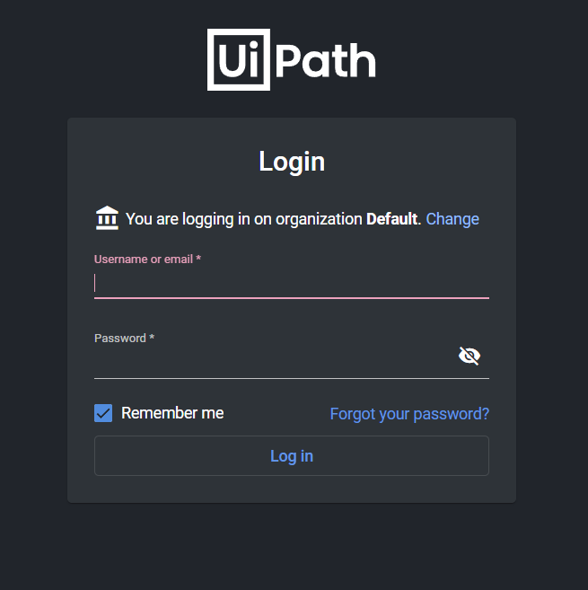

== Testing the deployment

To verify that the deployment is successful, take the following steps:

. Find all your deployments by accessing CloudFormation > Stacks.
. Click the stack you deployed. The CREATE_COMPLETE status indicates the deployment has completed successfully.
. Verify that Automation Suite is deployed successfully by navigating to the FQDN you provided as a parameter. The Login screen shown in the following image should be displayed.

== Post-deployment steps

For information about post-deployment steps, see https://docs.uipath.com/automation-suite/docs/aws-post-deployment-steps[Post-deployment steps].

== Best practices for using \{partner-product-short-name} on AWS

=== High availability and disaster recovery

Amazon EC2 provides the ability to place instances in multiple locations composed of AWS Regions and Availability Zones. Regions are dispersed and located in separate geographic areas. Availability Zones are distinct locations within a Region isolated from failures in other Availability Zones. They provide inexpensive, low-latency network connectivity to other Availability Zones in the same Region.

To make sure that an application is closer to certain customers, or for legal or design requirements, you can launch instances in separate Regions. By launching your instances in separate Availability Zones, you can protect your applications from the failure of a single location. Automation Suite provides infrastructure features that complement the high availability and disaster recovery (DR) scenarios supported in the AWS Cloud. For more information, see https://docs.uipath.com/automation-suite/docs/high-availability-three-availability-zones[High Availability].

The Quick Start also provides the option to deploy into a minimum of two Availability Zones. This option mitigates the loss of quorum in the case of a failure of a single node. However, you can choose this option only in AWS Regions that include two or more Availability Zones. For a current list of Availability Zones, see https://aws.amazon.com/about-aws/global-infrastructure/[AWS Global Infrastructure].

To customize UiPath Automation Suite for your business, IT, and security requirements, consult the https://docs.uipath.com/automation-suite/docs/[UiPath Documentation Portal].

== Security

=== Security groups and firewalls

When Amazon EC2 instances are launched, they must be associated with a security group, which acts as a stateful firewall. You have complete control over the security group's inbound and outbound network traffic. You can build granular rules that are scoped by protocol, port number, and source/destination IP address, or other security groups. By default, all outbound traffic from security group is permitted. Inbound traffic, however, must be configured to allow the appropriate traffic to reach your instances. We recommend that you tightly control inbound traffic. Doing this reduces the attack surface of your EC2 instances yet leaves the following ports open for application communication.

* Automation Suite ports:

|===
| Port | Protocol | Purpose

| 22
| TCP
| For SSH  (cluster management debugging)

| 443
| TCP
| For HTTPS (accessing Automation Suite)

| 2379
| TCP
| etcd client port

| 2380
| TCP
| etcd peer port

| 6443
| TCP
| For accessing Kube API using HTTPS, and required for node joining

| 8472
| TCP
| Required for Flannel (VXLAN)

| 9345
| TCP
| For accessing Kube API using HTTP, required for node joining

| 10250
| TCP
| kubelet / metrics server

| 30000-32767
| TCP
| Internal communication between nodes in a cluster
|===

* Other ports:
 ** 2049 - NFS service
 ** 1443 - RDS database instance port

This Quick Start configures the following security groups:

|===
| Security group | Associated with | Inbound source | Ports

| ServiceFabricSecurityGroup
| Server and Agent Autoscaling Groups and dedicated EC2 instances
| Private subnets CIDR
| Inbound: 443, 22, 6443, 9345, 8472, 10250, 2379, 2380, 8472, 30000-32767 +
Outbound: any ports

| BastionSecurityGroup
| Bastion host
| 0.0.0.0/0
| Inbound: 22 +
Outbound: any ports

| DbSecurityGroup
| RDS database instance
| Private subnets CIDR
| Inbound: 1443 +
Outbound: any ports

| SharedStorageSecurityGroup
| EFS volume
| Private subnets CIDR
| Inbound: 2049 +
Outbound: any ports

| ELBSecurityGroup
| Application Load Balancer
| 0.0.0.0/0
| Inbound: 443 +
Outbound: 443
|===

=== Security of the AWS infrastructure

AWS provides a set of building blocks, such as Amazon EC2 and Amazon VPC, which you can use to provision your application's infrastructure. AWS operates under a shared security responsibility model. AWS is responsible for the security of the underlying cloud infrastructure, and you are responsible for securing workloads you deploy in AWS. For more information, see https://docs.aws.amazon.com/whitepapers/latest/introduction-aws-security/introduction-aws-security.pdf[Introduction to AWS Security].
