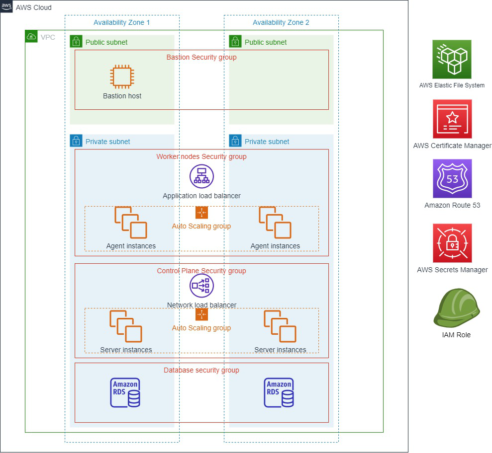

=== Architecture diagram
:doctype: book

Figure 1. Quick Start architecture for Automation Suite on AWS

=== Components

* A highly available architecture that spans two or more Availability Zones.
* A virtual private cloud (VPC) configured with public and private subnets, according to AWS best practices, to provide you with your own virtual network on AWS.
* In the public subnets:
 ** A Linux Bastion host to control inbound SSH (port 22) access to Amazon Elastic Compute Cloud (Amazon EC2) instances in the private subnets.
 ** Security groups for fine-grained inbound access to Bastion host instance.
* In the private subnets:
 ** An Amazon EC2 Auto Scaling group with Kubernetes server nodes. Nodes are hosted on Amazon EC2 instances running RedHat.
 ** An Amazon EC2 Auto Scaling group with Kubernetes agent nodes. Nodes are hosted on Amazon EC2 instances running RedHat.
 ** A database subnet group for Amazon Relational Database Service (Amazon RDS) DB instances running SQL Server.
 ** An Application Load Balancer or a Network Load Balancer to balance 443 inbound traffic between all Kubernetes nodes.
 ** An internal Network Load Balancer to balance 6443 (the kube API) and 9345 (the RKE2 registration address) traffic between the Kubernetes server nodes.
 ** Security groups for fine-grained access for the Kubernetes server nodes, as well as the agent nodes.
* AWS Certificate Manager for domain registration with a Secure Sockets Layer certificate.
* Amazon Route 53 as Domain Name System provider to route traffic to the Application Load Balancer.
* Multiple AWS Identity and Access Management (IAM) roles granting access to various operations required during deployment and installation.

=== Deployment and instance type mapping

The template dynamically computes the hardware needed for the deployment as follows:

* Depending on the services installed (basic or complete product selection), it sets minimum requirements at cluster level.
* Depending on the deployment profile (multi-node or single-node profile), it sets minimum requirements for a single VM.
* Selects the instance types based on their availability in the region you deploy and the aforementioned requirements.

The following table shows the mappings between deployment and possible instance types:

[cols="1,1"]
|===
| Deployment type | Instance type

| Basic single-node
| `+c5.4xlarge+`, `+c5a.4xlarge+`, `+m5.4xlarge+`, `+m5a.4xlarge+`

| Complete single-node
| `+c5a.8xlarge+`, `+c5.9xlarge+`, `+m5.8xlarge+`

| Basic multi-node
| `+c5.4xlarge+`, `+c5a.4xlarge+`, `+m5.4xlarge+`, `+m4.4xlarge+`

| Complete multi-node
| `+c5a.8xlarge+`, `+c5.9xlarge+`, `+m5.8xlarge+`, `+m5a.8xlarge+`
|===
